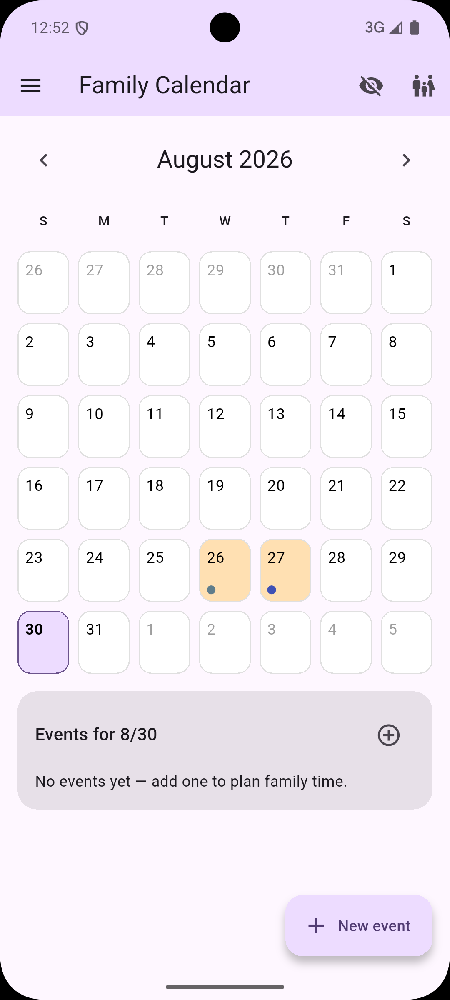
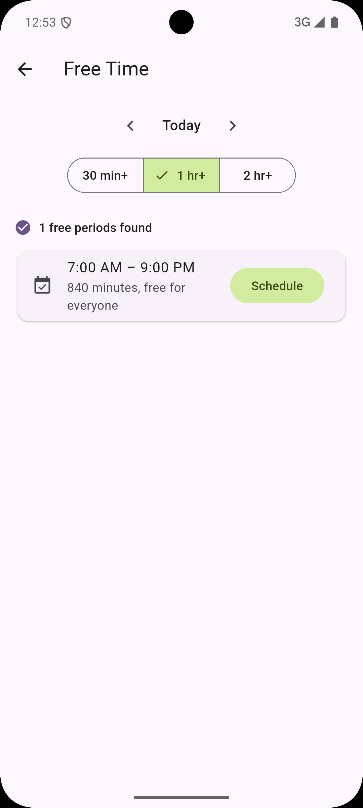
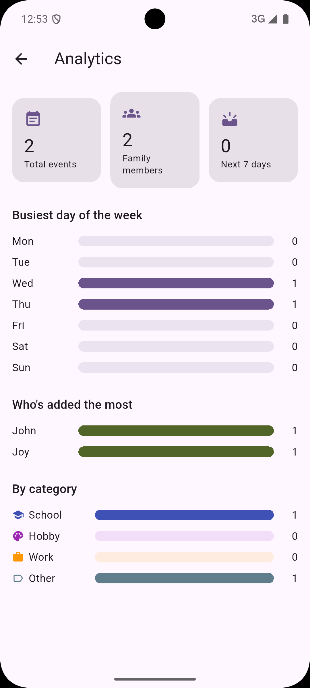
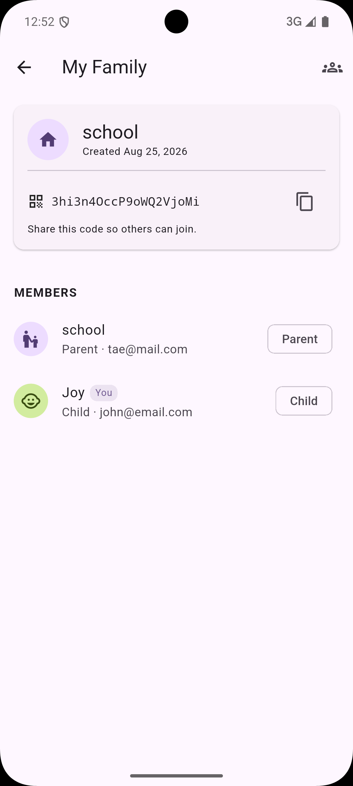
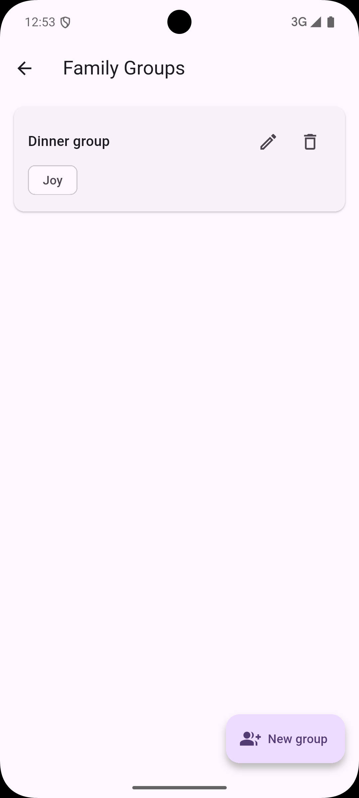
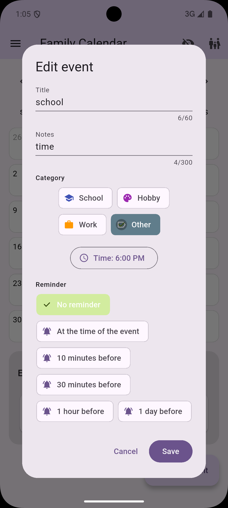
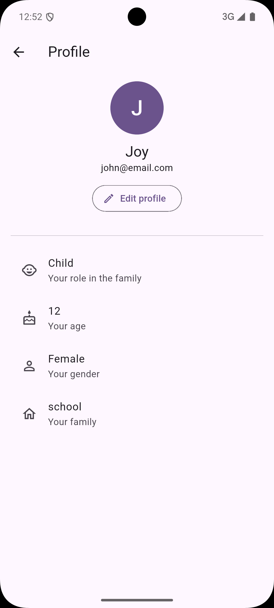
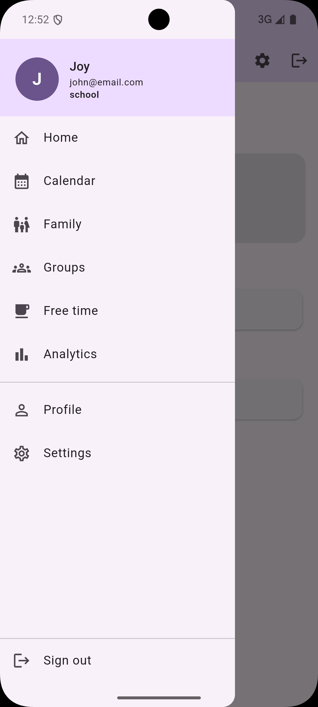
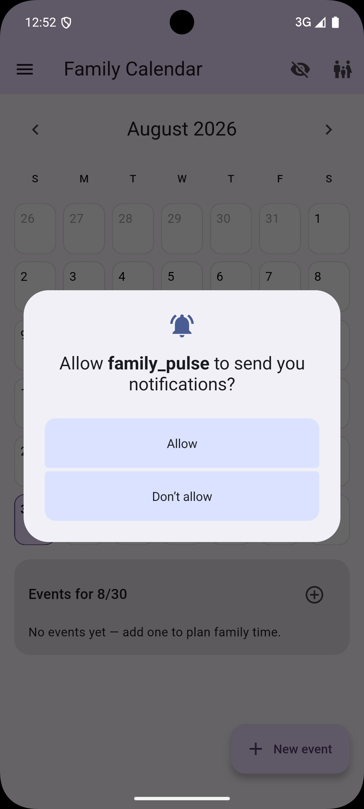

# FamilyPulse 📅

A Flutter + Firebase family calendar app that finds shared free time across school, hobbies, and work schedules — with family groups, member roles, recurring events, reminders, and profile photos.

**Status: feature-complete.** Every item on the roadmap is built and merged into `main`.

---

## Screenshots

<!--
  Drop the actual PNGs into docs/screenshots/ using the filenames below and
  these will render automatically — no other edits needed. Recommended:
  a phone-width screenshot (e.g. 390x844) from either the iOS simulator,
  an Android emulator, or `flutter run -d chrome` at a narrow window size.
-->

| | | |
|---|---|---|
|  |  |  |
| Family calendar (Pulse) | Free-time finder | Analytics |
|  |  |  |
| Family code + member roster | Family groups | Edit event — reminder picker |
|  |  |  |
| Profile — age, gender | Navigation menu | Reminder permission prompt |

---

## Getting Started

### Prerequisites

- Flutter 3.44.4+
- Dart 3.12+
- VS Code with Flutter + Dart extensions
- Android Studio (for an Android emulator) and/or Xcode (for iOS)
- Firebase CLI

### Setup

```bash
# 1. Clone the repo
git clone https://github.com/rex-daworker/family_pulse.git

# 2. Enter the project
cd family_pulse

# 3. Install packages
flutter pub get

# 4. Run the app
flutter run
```

### Firebase setup

The app expects `android/app/google-services.json` and
`ios/Runner/GoogleService-Info.plist` for the Firebase project
`family-pulse-sznzoj` (not committed — ask Rex for a copy, or point
`firebase_options.dart` at your own project).

Two things worth knowing if you're setting this up fresh:

- **Firestore and Auth work on Firebase's free Spark plan.** Profile
  photo upload does not — Firebase Storage requires the pay-as-you-go
  **Blaze** plan to be enabled at all, even for trivial usage within its
  free tier (5GB stored / 1GB day download). Set a Cloud Billing budget
  alert when you enable it so nothing runs away unnoticed.
- After enabling Storage, deploy the security rules once:
  `firebase deploy --only storage`.

---

## Key Features

- **Auth & family setup** — email/password sign-up with confirm-email/
  confirm-password validation, create a family or join one with a
  shareable code.
- **Family groups & roles** — parents can rename other members and set
  a label ("Mom", "Dad", etc.); everyone else gets a read-only roster.
  Enforced both in the UI and in Firestore security rules.
- **Shared calendar** — real-time event feed via Firestore streams,
  with categories (school / hobby / work / other).
- **Recurring events** — daily, weekly, monthly, or yearly presets with
  an optional end date.
- **Reminders** — on-device notifications ahead of an event (10 min /
  30 min / 1 hr / 1 day / at the time), rescheduled automatically each
  time the app opens.
- **Free-time finder** — scans every family member's events for a day
  and surfaces windows nobody has anything booked, with one tap to
  schedule right into that slot.
- **Profiles** — photo (camera or gallery, stored in Firebase Storage),
  age, and gender, editable by each member for themselves.
- **Analytics** — busiest day of the week, who's added the most events,
  breakdown by category.
- **Settings** — light/dark theme, and full localization in English,
  Finnish, and Swedish.
- **CI/CD** — every push runs `flutter analyze`, `dart format`, and
  `flutter test`, builds a debug APK, and emails the team on failure.

---

## Project Structure

```
family_pulse/
│
├── .github/workflows/
│   └── ci.yml                        # CI/CD — analyze/format/test/build + failure email
│
├── lib/
│   ├── main.dart                     # App entry point, routing (GoRouter), and the
│   │                                  # calendar screen + event editor dialog
│   ├── firebase_options.dart         # Auto-generated Firebase config
│   │
│   ├── core/
│   │   ├── theme/app_theme.dart      # Light and dark mode
│   │   ├── event_categories.dart     # school / hobby / work / other
│   │   ├── recurrence_options.dart   # daily / weekly / monthly / yearly
│   │   ├── reminder_options.dart     # reminder lead-time presets
│   │   ├── family_roles.dart         # parent / child roles
│   │   ├── gender_options.dart
│   │   ├── sign_out.dart
│   │   └── error_messages.dart       # localized error copy
│   │
│   ├── models/
│   │   ├── family_model.dart
│   │   ├── family_group_model.dart
│   │   ├── family_member_model.dart  # includes photo_url / age / gender
│   │   └── event_model.dart          # includes recurrence / reminder fields
│   │
│   ├── services/                     # Firebase backend logic
│   │   ├── auth_service.dart         # sign up, sign in, sign out
│   │   ├── event_service.dart        # CRUD, recurrence materialization,
│   │   │                             # free-time finder algorithm
│   │   ├── family_service.dart       # family/group creation and management
│   │   ├── storage_service.dart      # profile photo upload
│   │   └── notification_service.dart # local reminder scheduling
│   │
│   ├── providers/                    # Riverpod state management
│   │   ├── auth_provider.dart
│   │   ├── event_provider.dart
│   │   ├── group_provider.dart
│   │   └── settings_provider.dart
│   │
│   ├── screens/                      # UI screens
│   │   ├── auth/                     # welcome, login, register
│   │   ├── family/                   # create/join family, roster, groups
│   │   ├── home/                     # Pulse (landing) + free-time finder
│   │   ├── analytics/
│   │   ├── profile/
│   │   └── settings/
│   │
│   ├── widgets/                      # Reusable UI components
│   │   ├── app_drawer.dart
│   │   ├── name_label_dialog.dart
│   │   └── profile_edit_dialog.dart
│   │
│   └── l10n/                         # English / Finnish / Swedish (l10n.yaml + *.arb)
│
├── test/                             # Unit tests
├── storage.rules                     # Firebase Storage security rules
├── firestore.rules                   # Firestore security rules
├── pubspec.yaml                      # Dependencies
└── README.md
```

> A few early-skeleton files (`lib/models/user_model.dart`,
> `lib/screens/calendar/calendar_screen.dart`,
> `lib/screens/finder/free_time_screen.dart`,
> `lib/widgets/event_card.dart`, `free_slot_card.dart`, `member_avatar.dart`)
> are no longer imported anywhere — the app's actual calendar and
> free-time UI live in `main.dart` and `screens/home/`, per above. Worth a
> cleanup pass before final submission, but harmless to leave for now.

---

## Tech Stack

| Tool                        | Purpose                                    |
| --------------------------- | ------------------------------------------- |
| Flutter 3.44.4              | Mobile + web UI framework                   |
| Dart 3.12                   | Programming language                        |
| Firebase Auth               | User login and registration                 |
| Cloud Firestore             | Database — families, users, events, groups  |
| Firebase Storage            | Profile photo uploads                       |
| flutter_local_notifications | On-device event reminders                   |
| Flutter Riverpod            | State management                            |
| go_router                   | Navigation between screens                  |
| flutter_localizations       | English / Finnish / Swedish                 |
| GitHub Actions              | CI/CD — analyze, format, test, build, alert |

---

## Firestore Structure

```
families/
└── {family_id}/
    ├── name: String
    ├── created_at: Timestamp
    ├── users/
    │   └── {user_id}/
    │       ├── name: String
    │       ├── label: String                 // "Mom", "Dad", optional
    │       ├── role: "parent" | "child"
    │       ├── email: String
    │       ├── photo_url: String?
    │       ├── age: number?
    │       └── gender: String?
    ├── groups/
    │   └── {group_id}/ ...
    └── events/
        └── {event_id}/
            ├── title: String
            ├── description: String
            ├── start_time: Timestamp
            ├── end_time: Timestamp
            ├── category: "school" | "hobby" | "work" | "other"
            ├── user_id: String
            ├── user_name: String
            ├── recurrence: "none" | "daily" | "weekly" | "monthly" | "yearly"
            ├── recurrence_end_date: Timestamp?
            ├── series_id: String?            // shared by every occurrence of a series
            └── reminder_minutes_before: number?
```

Storage (`storage.rules`):

```
families/{family_id}/profile_photos/{user_id}.jpg   // ≤5MB, image/* only, write-your-own
```

---

## Task Division

### Backend

- `lib/services/` — all Firebase logic
- `lib/models/` — data models
- `lib/providers/` — Riverpod state management
- Firebase/Firestore/Storage security rules
- CI/CD pipeline

### Frontend

- `lib/screens/` — all UI screens
- `lib/widgets/` — reusable components
- `lib/core/theme/` — app styling
- `lib/l10n/` — translations

---

## Git Workflow

Everyone works on their own branch. Never commit directly to `main`.

```bash
# Start of every session
git checkout your-branch
git pull origin main

# End of every session
git add .
git commit -m "feat: what you built"
git push origin your-branch

# When a feature is done — open a Pull Request on GitHub
```

**Before starting new work, rebase onto the latest `main`** — several
features this project have been built twice by accident because a branch
sat behind main for a while without anyone noticing:

```bash
git fetch origin
git rebase origin/main
```

### Branch naming

- `rex/feature-name`
- `member-name/feature-name`

---

## CI/CD Pipeline

Every push and pull request automatically runs:

1. `flutter analyze` — checks for code issues
2. `dart format` — checks code formatting
3. `flutter test` — runs all unit tests
4. `flutter build apk` — builds a debug APK
5. On failure, emails the team (`GMAIL_USERNAME`/`GMAIL_APP_PASSWORD`
   secrets, `CI_NOTIFY_EMAILS` repo variable)

A pull request must pass all checks before it can be merged to `main`.
